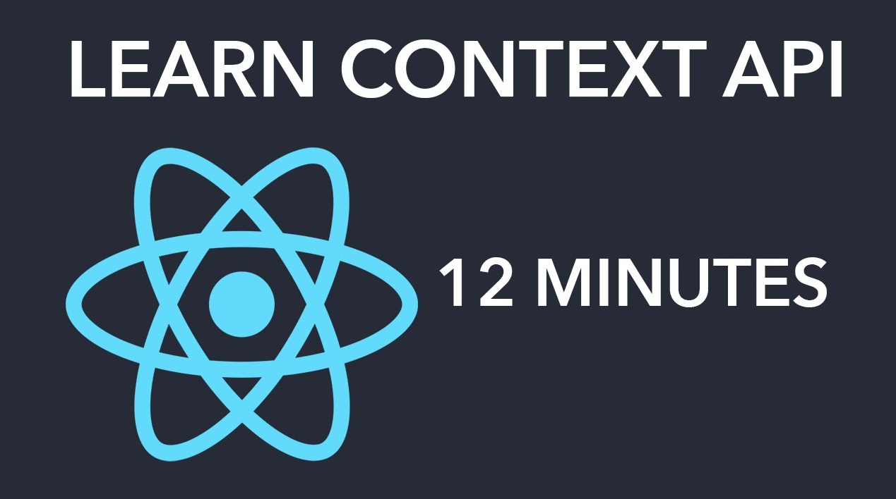

 
 

## Context API Tutorial For Beginners - Using React Hooks

https://www.youtube.com/watch?v=sP7ANcTpJr8&ab_channel=PedroTech

> In this video I will teach you guys how to use the Context API for State Management in React. We will be using the CreateContext and UseContext hooks to create a context allowing us to manage different states in a React Application.

Project --> **Login Context** 
Channel --> **PedroTech 173 mil inscritos** 
Date Created --> **16 de dez. de 2020**

### Observations

-  create-react-app
-  createContext
-  useContext
-  Login Page will set all of the context
-  Profile Page will grab all the context and display it

### Components

-  AppMain
   -  Login
      -  LoginContext
   -  Profile

### Tags

-  Context API
-  UseContext
-  ReactJS Tutorial
-  ReactJS and MySQL
-  NodeJS Tutorial
-  API Tutorial
